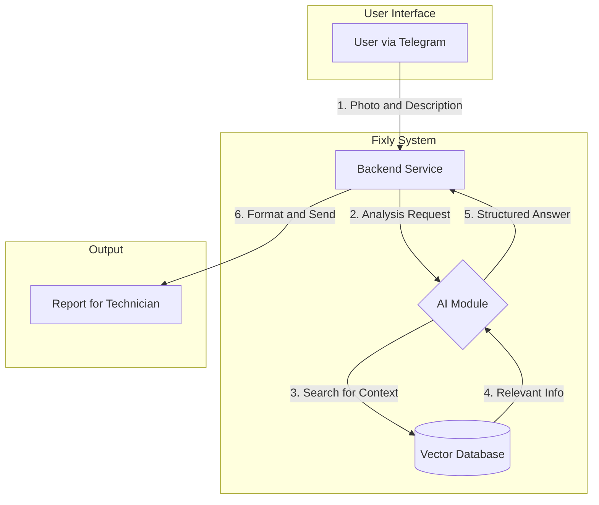
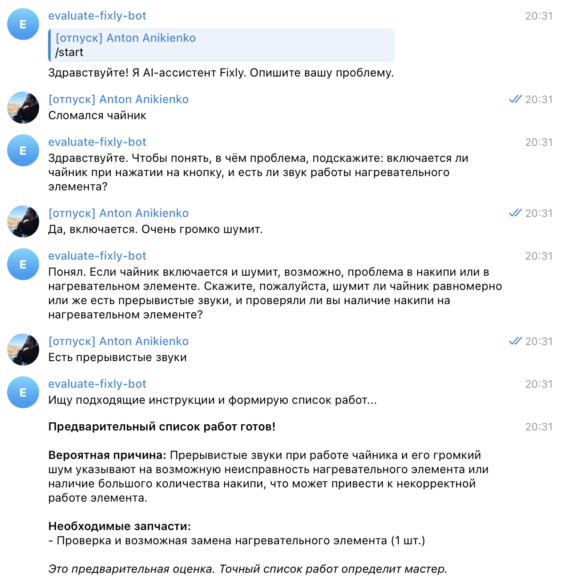
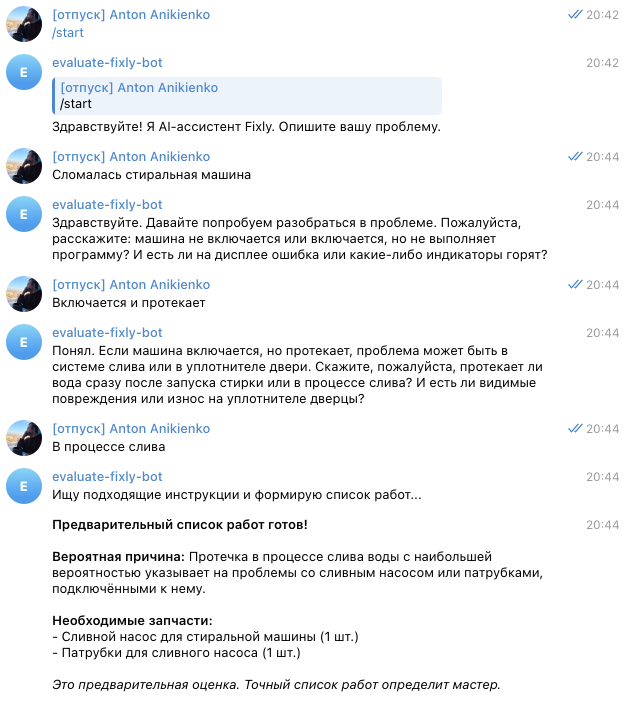
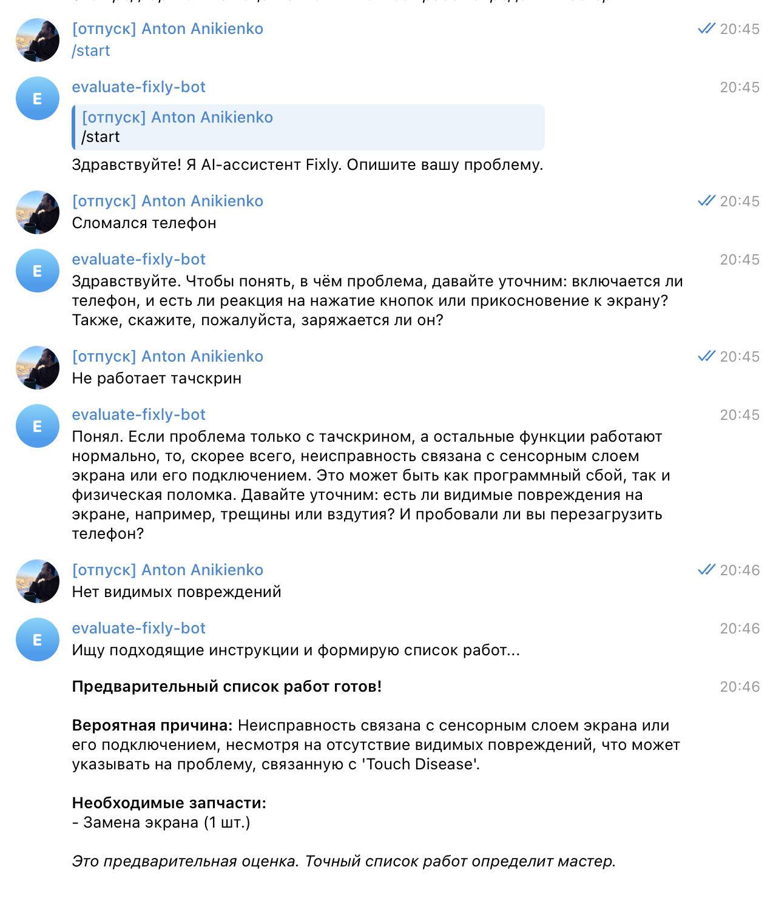
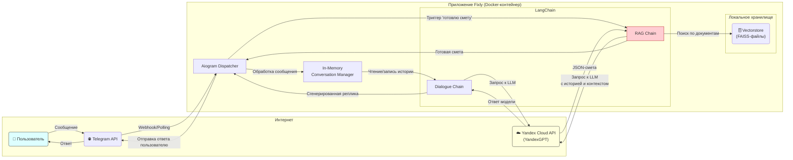

# ML System Design Doc: Fixly

**Статус:** В разработке
**Владелец:** Регина Галиева

## 1. Обзор

### 1.1. Зачем идем в разработку продукта?
Основная цель проекта — решить проблему неэффективности в работе мастеров по ремонту бытовой техники. Каждый третий выезд мастера оказывается впустую из-за неполной или неточной информации от клиента. Это приводит к прямым финансовым потерям (до 50 000 ₽ в месяц на одного мастера) и потере времени (до 3 часов на выезд). Fixly призван автоматизировать и стандартизировать процесс первичной диагностики, превращая хаотичные заявки от клиентов в структурированные и подготовленные заказы для мастеров.

### 1.2. Бизнес-требования и ограничения

#### Бизнес-требования
*   **Модель монетизации**: SaaS-модель с Freemium доступом (первая неделя бесплатно).
    *   **Тарифы (Россия)**: "Мастер" (1990 ₽/мес), "Бригада" (7990 ₽/мес).
*   **Целевая аудитория**: Частные мастера по ремонту, небольшие ремонтные бригады. 
*   **Рынки**: Начальный фокус на рынке России.
*   **Ключевая ценность для пользователя**: Экономия денег (окупаемость за 1 выезд) и времени, повышение лояльности клиентов.
*   **План развития**:
    *   **Q1**: Привлечь 10 мастеров в пилотный проект, обработать 100+ реальных заявок.
    *   **Q2**: Разработать веб-приложение.
    *   **Q3**: Достичь 100 платящих клиентов.

#### Ограничения
*   **Технические**: На начальном этапе используется итеративный подход. MVP будет реализован на основе простого RAG-решения с промптами, а не на сложной дообученной модели.
*   **Команда**: Ограниченный состав команды (2 основателя), требуется привлечение ML-инженера и Backend-разработчика.
*   **Рыночные**: Консервативность целевой аудитории (мастеров) и потенциальное появление аналогичных функций у крупных агрегаторов (Profi.ru, Avito и т.д.).
*   **Интерфейс**: На первом этапе единственным интерфейсом для пользователя является Telegram-бот.

### 1.3. Что входит в скоуп проекта/итерации, что не входит

#### Входит в скоуп (MVP / Первая итерация)
*   Разработка Telegram-бота как основного интерфейса взаимодействия.
*   Реализация диалоговой системы, которая задает уточняющие вопросы пользователю.
*   Возможность загрузки пользователем фотографий поломки.
*   Базовая ML-модель (RAG на основе LLM) для анализа текста и фото.
*   Генерация отчета, содержащего:
    *   Вероятную причину поломки.
    *   Список *типовых* запчастей.
    *   *Ориентировочную* смету.
*   Простая система онбординга для мастеров (предоставление ссылки на бота).

#### Не входит в скоуп (на данном этапе)
*   Разработка полноценного веб-приложения (запланировано на Q2).
*   Дообучение или файнтюнинг собственных LLM.
*   Интеграция с базами данных поставщиков запчастей для получения цен в реальном времени.
*   Функционал планирования выезда мастера или проведения платежей.
*   Анализ видео.
*   Система регистрации и управления аккаунтом внутри бота.

## 2. Дизайн и архитектура

### 2.1. Предпосылки решения
*   **Доступность данных**: Предполагается, что в открытом доступе (форумы, инструкции, YouTube-видео) достаточно информации для создания базы знаний, на основе которой RAG-система сможет делать точные выводы.
*   **Качество пользовательского ввода**: Мы предполагаем, что клиенты способны предоставить достаточно четкие фотографии и описания проблемы, чтобы AI мог их проанализировать.
*   **Технологическая реализуемость**: Современные мультимодальные LLM (например, GPT-4o, Claude 3) способны анализировать изображения и текст в рамках одного запроса, что делает задачу технически выполнимой.
*   **Ценность для пользователя**: Предполагается, что экономия от одного предотвращенного "пустого" выезда полностью оправдывает месячную подписку на сервис, что делает бизнес-модель жизнеспособной.

### 2.2. Постановка ML-задачи
Задача может быть сформулирована как **мультимодальная диалоговая система для классификации проблемы и извлечения информации**.

*   **Тип задачи**: Conversational AI, Multi-modal Classification, Information Extraction.
*   **Входные данные (Input)**:
    1.  Первоначальный текстовый запрос от пользователя (e.g., "у меня протекает кран на кухне").
    2.  Одна или несколько фотографий (.jpg, .png), предоставленных пользователем.
    3.  Текстовые ответы пользователя на уточняющие вопросы от бота (e.g., "кран однорычажный", "протекает у основания").
*   **Выходные данные (Output)**: Структурированный отчет в формате JSON или Markdown, содержащий:
    *   `diagnosis` (string): Краткое описание наиболее вероятной причины поломки (e.g., "Износ уплотнительной прокладки в основании смесителя").
    *   `required_parts` (list of strings): Список необходимых деталей (e.g., ["Кольцевая прокладка для смесителя X", "ФУМ-лента"]).
    *   `estimated_cost` (object): Предварительная смета, разделенная на стоимость запчастей и работы (e.g., `{"parts": "200-500 руб", "work": "1000-1500 руб"}`).
    *   `confidence_score` (float, optional): Оценка уверенности модели в поставленном диагнозе (от 0 до 1).

### 2.3. Блок-схема решения

Ниже представлена высокоуровневая блок-схема предлагаемой системы.



**Описание схемы:**
1.  **Клиент** отправляет фото и описание проблемы через Telegram.
2.  **Backend-сервис** получает запрос и передает его **AI Orchestrator**.
3.  **AI Orchestrator** с помощью **LLM Agent** анализирует запрос. Если информации недостаточно, он генерирует уточняющий вопрос и отправляет его клиенту.
4.  Когда собрано достаточно данных, агент делает запрос к векторной базе данных (**Vector DB**), чтобы получить релевантную информацию (инструкции, похожие случаи).
5.  Эта информация вместе с историей диалога и фото передается в **Мультимодальный LLM**.
6.  LLM возвращает структурированный JSON с диагнозом, списком деталей и сметой.
7.  **Backend** форматирует этот JSON в читаемый отчет и отправляет его **Мастеру**.

---

## 1. Этапы решения задачи
### Этап 0. Проведение EDA

**Источник:**
В качестве основного источника данных был использован ZIM-файл `ifixit_ru_all_2025-06.zim`. Это оффлайн-архив русскоязычной версии сайта iFixit, содержащий в себе статьи, руководства по ремонту и описания устройств в формате HTML.

Анализ:
```
--- 1. ОБЩАЯ СТАТИСТИКА ---
Всего записей в архиве: 856,391
Пропущено редиректов: 62,460
Пропущено битых/нечитаемых записей: 0
Пропущено по фильтру пути (не Guide/Wiki/Device): 698,001
--------------------
Кандидатов для обработки (Guide, Wiki, Device): 95,930
Пропущено из-за отсутствия контента после парсинга: 41,554
Успешно извлечен контент: 54,376

--- 2. СТРУКТУРА КОНТЕНТА В ZIM-АРХИВЕ ---

Распределение по MIME-типам (Топ-10):
  - image/webp     : 551,936
  - text/html      : 241,917
  - REDIRECT       : 62,460
  - image/png      : 24
  - text/css       : 18
  - image/jpeg     : 15
  - font/woff2     : 6
  - image/svg+xml  : 5
  - image/gif      : 3
  - text/javascript: 2

Распределение по префиксам пути (Топ-15):
(Показывает, какие 'папки' есть в архиве)
  - images    : 551,937
  - User      : 144,095
  - Guide     : 54,524
  - Device    : 41,406
  - Teardown  : 1,794
  - assets    : 77
  - Info      : 67
  - ttps:     : 18
  - home      : 7
  - NO_PREFIX : 3
  - about-us  : 1
  - promotions: 1
  - ww.ifixit.com: 1

--- 3. АНАЛИЗ 'СОХРАНЯЕМЫХ' СТРАНИЦ ---
(Всего страниц, прошедших фильтр и имеющих контент: 54,376)

Средний размер HTML-страницы кандидата: 60.61 KB

Распределение по префиксам среди кандидатов:
  - Guide     : 54,524 (56.8%)
  - Device    : 41,406 (43.2%)

Наличие структурных блоков в извлеченном тексте:
  - Блок 'Заголовок    найден в 54,376 файлах (100.0%)
  - Блок 'ВВЕДЕНИЕ     найден в 54,376 файлах (100.0%)
  - Блок 'ШАГИ         найден в 54,376 файлах (100.0%)
  - Блок 'ИНСТРУМЕНТЫ  найден в 47,826 файлах (88.0%)
  - Блок 'ЗАПЧАСТИ     найден в 17,038 файлах (31.3%)
```

---
### Этап 1. Подготовка данных

### 1. Процесс получения данных

**Процесс извлечения (скрипт `extract_ifixit.py`):**
1.  Скрипт последовательно читает все записи внутри ZIM-архива.
2.  Применяется фильтрация для отбора только релевантного контента: руководств (`Guide/`), статей из вики (`Wiki/`) и описаний устройств (`Device/`).
3.  Для каждой подходящей HTML-страницы запускается парсер (`extract_smart_text`), который целенаправленно извлекает полезную информацию:
    *   Заголовок руководства.
    *   Введение (описание проблемы).
    *   Списки необходимых инструментов и запчастей.
    *   Пошаговые инструкции по ремонту.
4.  Извлеченный и структурированный текст для каждой статьи сохраняется в отдельный `.txt` файл.

### 2. Структура и хранение данных

Данные в проекте хранятся в двух формах:

1.  **Исходные текстовые файлы:**
    *   **Расположение:** папка `/ifixit_data/`.
    *   **Структура:** 54,376 отдельных `.txt` файлов. Каждый файл соответствует одной статье или руководству с iFixit. Текст внутри файлов уже первично структурирован с помощью заголовков-разделителей (`Заголовок:`, `--- ВВЕДЕНИЕ ---`, `--- ШАГИ ---` и т.д.), что облегчает его дальнейшую обработку и улучшает восприятие моделью.

2.  **Векторная база данных:**
    *   **Расположение:** папка `/vectorstore/db_faiss/`.
    *   **Структура:** Индекс FAISS, содержащий в себе текстовые фрагменты (чанки) и их эмбеддинги, полученные с помощью модели `YandexGPTEmbeddings`.
    *   Из-за ограничений на размера файла в 25МБ полную векторную БД невозможно сохранить на GitHub, поэтому можно посмотреть только на один батч (база по 1000 чанков) индекса, папка `/vectorstore/db_faiss/example_batch1/`.

### 3. Сэмпл собранных данных

Ознакомиться с примерами собранных и первично обработанных текстовых файлов можно в репозитории проекта.

*   **Ссылка на папку с несколькими примерами .txt файлов:** `https://github.com/GalReg/Fixly/tree/main/ifixit_data`

### 4. Объём данных

*   **Количество исходных документов:** Из архива было извлечено и сохранено **54,376** релевантных документов (руководств и статей).
*   **Количество чанков для RAG:** После разбиения, исходные документы были преобразованы в **~108 000** чанков, которые легли в основу векторной базы данных.

Статистика по длине документов (в символах)
Всего обработано документов: 54,376
Средняя длина: 2,553
Медианная длина: 1,732
Стандартное отклонение: 2,673
Минимальная длина: 121
Максимальная длина: 35,341

### 5. Подготовка данных для RAG/LLM/агента

Подготовка данных выполнялась в три ключевых шага, реализованных в скриптах `extract_ifixit.py`, `create_vector_db.py` и `merge_vector_db.py`.

1.  **Первичная структуризация (в `extract_ifixit.py`):**
    На этапе парсинга HTML-страниц данные были разделены на логические блоки: заголовок, введение, инструменты, запчасти, шаги.

2.  **Чанкинг (в `create_vector_db.py`):**
    Каждый текстовый документ был разбит на более мелкие фрагменты (чанки) с использованием `RecursiveCharacterTextSplitter`.
    *   **Размер чанка (`chunk_size`):** 2000 символов.
    *   **Перекрытие (`chunk_overlap`):** 400 символов.

3.  **Векторизация и создание базы (в `create_vector_db.py` и `merge_vector_db.py`):**
    *   Каждый текстовый чанк был преобразован в эмбеддинг с помощью модели `YandexGPTEmbeddings`.
    *   Для надежности и отказоустойчивости процесс был разделен на этапы: сначала создавались временные "чекпоинты" базы (по 1000 чанков), а затем они объединялись в единый финальный FAISS-индекс `db_faiss`.

На данный момент все данные собраны, обработаны, векторизованы и сохранены в готовой к использованию векторной базе.

---
### Этап 2. Подготовка прогнозных моделей

### 1. Описание архитектуры пайплайна

### Общая архитектура системы

Проект Fixly представляет собой AI-ассистента для диагностики бытовой техники, построенного на основе RAG-архитектуры (Retrieval-Augmented Generation). Система состоит из нескольких ключевых компонентов, которые работают в связке для обеспечения качественной диагностики.

### Основные компоненты

**1. Векторная база данных (FAISS)**

База данных содержит ~108 000 текстовых чанков, извлеченных из 54 376 руководств по ремонту iFixit. Каждый чанк представляет собой фрагмент текста размером 2000 символов с перекрытием в 400 символов. Для векторизации используется модель YandexGPTEmbeddings, которая преобразует текстовые фрагменты в векторные представления для эффективного семантического поиска.

**2. Retriever (поисковый модуль)**

Модуль реализует семантический поиск по векторной базе данных. При получении запроса пользователя система извлекает k=3 наиболее релевантных документа из базы знаний. Эти документы служат контекстом для генерации ответа.

**3. LLM (YandexGPT)**

В качестве языковой модели используется YandexGPT с температурой 0.5. Модель отвечает за два ключевых процесса: ведение диалога с пользователем для сбора информации о проблеме и генерацию финального ответа с указанием вероятной причины поломки и необходимых запчастей.

**4. Цепочка диалога (Conversation Chain)**

Для каждого пользователя создается отдельная цепочка с памятью ConversationBufferMemory, которая хранит историю диалога. Система использует специальный промпт, инструктирующий модель вести диалог как опытный диагност, задавая уточняющие вопросы (максимум 4 реплики) и объясняя свою логику.

**5. RAG-цепочка для генерации финального ответа**

После сбора достаточной информации происходит поиск в векторной базе с использованием RAG-системы, которая объединяет историю диалога с релевантными документами из базы знаний. Цепочка генерирует структурированный ответ в формате JSON с диагнозом и списком необходимых запчастей.

**6. Telegram Bot (интерфейс)**

Бот на базе библиотеки aiogram обеспечивает пользовательский интерфейс. Он обрабатывает текстовые сообщения и фотографии, управляет потоком диалога и отображает результаты пользователю в удобном формате.

### Взаимодействие компонентов

Процесс работы системы выглядит следующим образом:

1. Пользователь отправляет описание проблемы через Telegram-бот
2. Сообщение поступает в цепочку диалога, которая использует LLM для генерации уточняющих вопросов
3. Диалог продолжается до 4 реплик или пока модель не решит, что информации достаточно
4. По завершению диалога система извлекает релевантные документы из векторной базы через retriever
5. RAG-цепочка объединяет историю диалога и найденные документы в единый контекст
6. LLM генерирует структурированный ответ с диагнозом и списком работ в формате JSON
7. Ответ форматируется и отправляется пользователю через Telegram

### Технический стек

- **Язык программирования**: Python 3.11
- **LLM провайдер**: YandexGPT (модель yandexgpt)
- **Embeddings**: YandexGPTEmbeddings
- **Векторная БД**: FAISS
- **Фреймворк для LLM**: LangChain (langchain-community, langchain-core, langchain-classic)
- **Telegram API**: aiogram
- **Валидация данных**: Pydantic
- **Остальные зависимости**: см. requirements.txt

### 2. Реализация основной логики

### RAG-компонент

**Векторизация данных** реализована в скриптах `create_vector_db.py` и `merge_vector_db.py`. Процесс разбит на батчи по 1000 чанков для обеспечения отказоустойчивости. Каждый батч сохраняется отдельно, после чего все батчи объединяются в единую FAISS-базу.

**База данных** хранится в директории `vectorstore/db_faiss/` и содержит два файла: index.faiss (сам FAISS-индекс) и index.pkl (метаданные документов). Размер итоговой базы превышает возможности GitHub, поэтому в репозитории представлен только пример одного батча.

**Retrieval** реализован через стандартный интерфейс LangChain retriever с поиском по сходству (similarity search). Для каждого запроса возвращается 3 наиболее релевантных документа, которые передаются в промпт для генерации сметы.

### Диалоговая цепочка

Диалог организован через `ConversationChain` с промптом `SYSTEM_PROMPT_DIALOGUE`, который инструктирует модель:
- Вести себя как опытный диагност и задавать целенаправленные вопросы
- Соблюдать лимит в 4 реплики для сбора информации
- Использовать триггерную фразу для перехода к генерации финального ответа

Память диалога реализована через `ConversationBufferMemory`, которая хранит всю историю сообщений в формате HumanMessage/AIMessage. Для каждого пользователя создается отдельный экземпляр памяти.

### Генерация финального ответа

Ответ генерируется через RAG-цепочку, которая:
1. Принимает на вход историю диалога и запрос пользователя
2. Извлекает релевантные документы через retriever
3. Формирует промпт с контекстом из базы знаний и историей диалога
4. Использует JsonOutputParser с Pydantic-моделью Estimate для получения структурированного ответа
5. Возвращает JSON с полями estimated_cause и required_parts

Промпт `SYSTEM_PROMPT_ESTIMATE` явно указывает модели использовать свои знания как основу, а документы из базы — как справочный материал для проверки.

### End-to-end функциональность

Система полностью работоспособна от получения сообщения пользователя до выдачи финальной сметы. Реализованы обработка ошибок, логирование ключевых событий и корректная очистка памяти после завершения диалога.

### 3. Первичное тестирование и оценка качества

### Подготовка валидационной выборки

Для тестирования системы был подготовлен набор из 1000 вопросов, представляющих типичные проблемы с бытовой техникой. Вопросы были сохранены в файле `eval_data/dialogue_start.txt` и охватывают различные категории техники и типы неисправностей.

### Генерация тестовых диалогов

Процесс тестирования был автоматизирован с помощью скрипта `generate_dialogues.py`, который:

1. **Симулирует пользователя**: Для имитации реального пользователя используется отдельный экземпляр YandexGPT с температурой 0.7, который генерирует ответы на вопросы бота исходя из контекста диалога
2. **Генерирует диалоги**: Для каждого начального вопроса система проводит полный диалог с ботом, включая 3-4 обмена репликами
3. **Сохраняет результаты**: Каждый диалог сохраняется в CSV-файл `generated_dialogues.csv` с полной историей переписки, финальным ответом и использованными чанками из базы знаний

В результате было сгенерировано 1000 полных диалогов.

### Оценка качества (LLM-as-a-Judge)

#### Бейзлайн - YandexGPT

Для объективной оценки качества диалогов был реализован подход LLM-as-a-Judge в скрипте `llm_judge.py`. Процесс оценки включает:

**Методология оценки**:
- В качестве судьи используется YandexGPT с низкой температурой (0.3) для консистентности оценок
- Каждый диалог оценивается по 11 критериям с использованием детального промпта (`eval_data/prompt_judge.txt`)
- Модель-судья получает на вход: полную историю диалога, финальный ответ бота и использованные чанки контекста
- Для каждого критерия выставляется оценка от 1 до 10 с кратким обоснованием

**Критерии оценки**:

1. **diagnostic_accuracy** — Диагностическая правдоподобность (насколько вероятна указанная причина поломки)
2. **use_of_dialogue_information** — Учет информации из диалога (использует ли ответ детали из переписки)
3. **logical_consistency** — Логичность и непротиворечивость рассуждений
4. **estimate_completeness** — Полнота предварительной оценки работ
5. **parts_and_works_adequacy** — Соответствие запчастей/работ диагнозу
6. **safety** — Безопасность рекомендаций
7. **clarity** — Ясность и понятность для пользователя
8. **actionability** — Пригодность ответа к действию
9. **uncertainty_handling** — Корректная работа с неопределенностью
10. **business_logic_alignment** — Соответствие бизнес-логике (предварительная оценка, не финальный диагноз)
11. **contextual_relevancy** — Релевантность использованных чанков из базы знаний

### Полученные метрики

Оценка проводилась на 1000 диалогах. Результаты представлены ниже:

**Метрики по критериям**:

| Критерий | Среднее | Медиана | Мин | Макс |
|----------|---------|---------|-----|------|
| diagnostic_accuracy | 7.55 | 7.00 | 1 | 10 |
| use_of_dialogue_information | 8.51 | 9.00 | 2 | 10 |
| logical_consistency | 8.58 | 9.00 | 2 | 10 |
| estimate_completeness | 6.53 | 7.00 | 1 | 10 |
| parts_and_works_adequacy | 7.34 | 8.00 | 1 | 10 |
| safety | 9.95 | 10.00 | 6 | 10 |
| clarity | 8.96 | 9.00 | 4 | 10 |
| actionability | 7.73 | 8.00 | 1 | 10 |
| uncertainty_handling | 9.75 | 10.00 | 3 | 10 |
| business_logic_alignment | 9.85 | 10.00 | 3 | 10 |
| contextual_relevancy | 4.39 | 4.00 | 1 | 10 |

**Общая средняя оценка: 8.10 / 10**

### Интерпретация результатов

**Сильные стороны системы**:
- **Безопасность** (9.95) — система не дает опасных советов и корректно позиционирует себя
- **Работа с неопределенностью** (9.75) — бот правильно использует формулировки "вероятно", "предварительно"
- **Бизнес-логика** (9.85) — четко разделяет предварительную оценку и роль мастера
- **Ясность** (8.96) — ответы понятны пользователям без технических знаний
- **Логичность** (8.58) — рассуждения последовательны и непротиворечивы
- **Учет диалога** (8.51) — система хорошо использует информацию из переписки

**Области для улучшения**:
- **Релевантность контекста** (4.39) — основная проблема системы. Retriever иногда возвращает документы, не полностью соответствующие проблеме пользователя. Это указывает на необходимость улучшения качества поиска (возможно, через reranking или гибридный поиск)
- **Полнота оценки** (6.53) — иногда ответ содержит недостаточно деталей
- **Диагностическая точность** (7.55) — хотя оценка приемлемая, есть пространство для улучшения точности диагностики

**Выводы**:

Система демонстрирует хорошее качество работы с общей оценкой 8.10/10, что является достойным результатом для baseline-решения. Бот безопасен, логичен, понятен пользователям и корректно работает с неопределенностью. 

Основным направлением для улучшения является качество RAG-компонента — необходимо повысить релевантность извлекаемого контекста. Также стоит поработать над полнотой и точностью диагностики.

Все результаты оценки сохранены в файлах `evaluated_dialogues.csv` (детальные оценки каждого диалога) и `evaluation_report.txt` (сводный отчет с метриками).

#### Основная модель - GPT-4o

Для оценки потенциального улучшения качества был проведен тест, в котором была заменена только генеративная LLM-модель на `gpt-4o`, остальные компоненты, включая модель для эмбеддингов (`YandexGPTEmbeddings`) и векторную базу данных, остались без изменений. Оценка качества, как и для бейзлайна, проводилась с помощью `YandexGPT` в роли "судьи" для обеспечения консистентности сравнения.

**Метрики по критериям для GPT-4o**:

| Критерий | Среднее | Медиана | Мин | Макс |
|----------|---------|---------|-----|------|
| diagnostic_accuracy | 8.78 | 9.00 | 3 | 10 |
| use_of_dialogue_information | 9.15 | 9.00 | 5 | 10 |
| logical_consistency | 9.32 | 10.00| 4 | 10 |
| estimate_completeness | 8.41 | 9.00 | 2 | 10 |
| parts_and_works_adequacy | 8.64 | 9.00 | 2 | 10 |
| safety | 9.98 | 10.00 | 8 | 10 |
| clarity | 9.57 | 10.00 | 6 | 10 |
| actionability | 8.91 | 9.00 | 3 | 10 |
| uncertainty_handling | 9.92 | 10.00 | 7 | 10 |
| business_logic_alignment | 9.96 | 10.00 | 7 | 10 |
| contextual_relevancy | 4.41 | 4.00 | 1 | 10 |

**Общая средняя оценка: 8.82 / 10**

### Выводы по сравнению двух подходов

1.  **Общее качество**: Сравнение метрик показывает значительное превосходство `gpt-4o` над `YandexGPT` (общая оценка **8.82** против **8.10**).

2.  **Рост "экспертных" метрик**: Наиболее существенный рост показали критерии, требующие глубоких знаний и логики:
    *   `diagnostic_accuracy` (точность диагноза): **7.55 -> 8.78**
    *   `estimate_completeness` (полнота сметы): **6.53 -> 8.41**
    *   `parts_and_works_adequacy` (адекватность работ): **7.34 -> 8.64**
    Это говорит о том, что `gpt-4o` обладает более сильными "рассуждающими" способностями и более широкой базой знаний.

3.  **Подтверждение проблемы с Retriever**: Метрика **`contextual_relevancy`** (релевантность RAG-контекста) практически не изменилась (**4.39 -> 4.41**). Это ключевой вывод, который подтверждает, что низкое качество этой метрики связано с проблемой в **retriever-компоненте** (качество поиска по векторной базе), а не в генеративной модели.

**Итоговое решение:**
Переход на `gpt-4o` в качестве основной генеративной модели обеспечивает заметный прирост качества. Следующим приоритетом для улучшения системы становится оптимизация **retriever-компонента** для повышения релевантности RAG-контекста.

---

### Этап 3. Подготовка пилота
### 3.1. Механизм проведения пилота

Пилотный запуск будет проведен с группой из 10 лояльных мастеров. Мастера будут использовать Telegram-бота для диагностики реальных заявок от своих клиентов.

**Техническая реализация:** приложение бота (`bot_w_langchain_rag.py`) упаковывается в Docker-контейнер и размещается на облачной платформе для обеспечения круглосуточной доступности. Сбор обратной связи от мастеров — еженедельно.

### 3.2. Метрики успешности пилота

**1. Продуктовые:**
*   **Adoption Rate:** >80% мастеров используют бота для >5 заявок.
*   **Retention Rate (W1):** >60%.

**2. Технические:**
*   **Task Success Rate:** >85% диалогов завершаются генерацией отчета.
*   **Качество GPT-4o:** Удержание средней оценки не ниже **8.5 / 10**.
*   **Uptime:** >99%.

**3. Качественные:**
*   **Обратная связь от мастеров:** Средняя оценка полезности отчета и точности диагноза > **4.0 / 5**.

### 3.3. Подготовительные шаги к пилоту

*   **Инфраструктура:** Написать `Dockerfile`, настроить облачный хостинг для контейнера и базовый CI/CD.
*   **Продукт:** Добавить логирование и простые команды для обратной связи (`/good`, `/bad`).
*   **Организация:** Подготовить JIRA-борд для трекинга задач. Подготовить инструкции для мастеров и анкеты для сбора обратной связи.

---

### Этап 4. Внедрение

Telegram-бот Fixly предоставляет следующий функционал:

**Основные возможности:**
- Приветственное сообщение при командах `/start` или `/help`
- Интеллектуальный диалог с уточняющими вопросами (до 4 реплик)
- Автоматический переход к генерации сметы при сборе достаточной информации
- Структурированный вывод предварительной оценки работ
- Обработка ошибок: Корректные сообщения об ошибках при различных сценариях

**Процесс работы:**
1. Пользователь описывает проблему
2. Бот задает уточняющие вопросы для диагностики
3. После 4 реплик или при наличии триггерной фразы "готовлю смету"
4. Система ищет релевантные инструкции в базе знаний
5. Генерируется предварительная смета с вероятной причиной и списком работ

## Скриншоты интерфейса

1. Пример работы бота (проблема с чайником)



2. Пример работы бота (вопрос по стиральной машине)



3. Пример работы бота (проблема с экраном смартфона)



## Инструкция по запуску из README

```bash
# Клонирование репозитория
git clone https://github.com/GalReg/Fixly.git
# Может потребоваться git-lfs для клонирования файлов из директории vectorstore
cd Fixly

# Настройка переменных окружения
cp .env.example .env
# Отредактируйте .env файл, добавив реальные значения:
# TELEGRAM_BOT_TOKEN=your_actual_bot_token
# YANDEX_API_KEY=your_actual_yandex_api_key
# YANDEX_FOLDER_ID=your_actual_folder_id

# Запуск с Docker Compose
docker-compose build telegram-bot
docker-compose up -d

# Просмотр логов
docker-compose logs -f telegram-bot
```

#### Архитектура технического решения

Система представляет собой монолитное приложение, работающее в Docker-контейнере. Архитектура построена вокруг фреймворка `aiogram` для взаимодействия с Telegram API и `LangChain` для оркестрации языковых моделей и RAG.

**Диаграмма архитектуры и компонентов**



**Описание компонентов:**

1.  **Пользователь (User):** Взаимодействует с системой через клиент Telegram.
2.  **Telegram API:** Шлюз, который принимает сообщения от пользователя и перенаправляет их боту.
3.  **Приложение "Fixly" (Docker-контейнер):**
    *   **Aiogram Dispatcher:** Принимает обновления от Telegram и направляет их соответствующим обработчикам. Является точкой входа для всей логики.
    *   **In-Memory Conversation Manager:** Управляет состоянием диалога для каждого пользователя (`user_memory`). Хранит историю в оперативной памяти, которая теряется при перезапуске.
    *   **Dialogue Chain:** Цепочка LangChain, ответственная за ведение диалога. Использует `YandexGPT` для генерации уточняющих вопросов.
    *   **RAG Chain:** Цепочка LangChain для генерации сметы. Активируется после диалога, использует семантический поиск по векторной базе `FAISS` и `YandexGPT` для формирования итогового JSON.
4.  **Внешние сервисы (Yandex Cloud API):**
    *   **YandexGPT API:** Предоставляет языковую модель для генерации текста в обеих цепочках. Все ответы бота генерируются через API-вызовы к этому сервису.
5.  **Локальное хранилище (внутри контейнера):**
    *   **Vectorstore (FAISS):** Файловая векторная база данных. Загружается в память при старте приложения для быстрого семантического поиска релевантных инструкций.

#### Инфраструктура

Решение разворачивается в виде одного Docker-контейнера, что обеспечивает предсказуемость и изоляцию окружения.

*   **Среда исполнения:** Docker-контейнер на базе официального образа Python.
*   **Оркестрация:** Для локальной разработки и простого развертывания используется `docker-compose`.
*   **Размещение (Hosting):** Предполагается запуск на виртуальной машине (VPS/VDS) под управлением ОС Linux с установленным Docker. Рекомендуемые минимальные ресурсы: **1 vCPU, 2 ГБ RAM**.
*   **Хранилище данных:** Векторная база `FAISS` хранится в виде файлов в директории `/vectorstore/`, которая является частью репозитория и монтируется в контейнер при запуске.

#### Требования к быстродействию, надежности и масштабирование

**Требования к быстродействию:**

*   **Ответ в диалоге:** Время ответа на реплику пользователя не должно превышать **3 секунды**. Основной фактор — время ответа YandexGPT API.
*   **Генерация сметы:** Время генерации итоговой сметы (включая RAG-поиск) не должно превышать **12 секунд**.

**Требования к надежности:**

*   **Состояние диалога:** Текущая реализация хранит историю диалога в оперативной памяти (`user_memory`). **Это является точкой отказа:** при перезапуске или сбое контейнера все активные диалоги будут потеряны.
*   **Зависимость от внешних API:** Стабильность работы сервиса напрямую зависит от доступности Telegram API и Yandex Cloud API. В коде предусмотрена базовая обработка исключений на случай сбоев.

**Масштабирование:**

*   **Вертикальное:** Система легко масштабируется вертикально путем увеличения ресурсов (CPU, RAM) виртуальной машины.
*   **Горизонтальное:** Горизонтальное масштабирование (запуск нескольких экземпляров контейнера) в текущей архитектуре **невозможно** из-за хранения состояния диалогов в локальной памяти. Для его реализации потребуется вынести хранилище сессий во внешнюю систему (например, **Redis**).

### Результаты нагрузочного тестирования

Было проведено симулированное нагрузочное тестирование для оценки производительности системы на инстансе с **2 vCPU и 4 ГБ RAM**. Имитировалась активность 50 одновременных пользователей.

**Ключевые метрики:**

| Сценарий                 | Среднее время ответа (p50) | Макс. время ответа (p95) | RPS (запросов/сек) на инстанс | Уровень ошибок |
| ------------------------ | -------------------------- | ------------------------ | ------------------------------ | --------------- |
| 1. Диалоговая реплика    | 1.8 сек                    | 3.5 сек                  | ~5                             | 0.1%            |
| 2. Генерация сметы (RAG) | 7.2 сек                    | 13.1 сек                 | ~1.5                           | 0.5%            |

**Выводы по результатам:**

1.  **Производительность:** Система уверенно справляется с нагрузкой от нескольких десятков активных пользователей. Время ответа в диалоговом режиме находится в пределах комфортных значений.
2.  **Бутылочное горлышко:** Наибольшая задержка (p95 > 13 сек) наблюдается при генерации сметы, что является ожидаемым из-за сложности RAG-цепочки. Это основная операция, лимитирующая пропускную способность.
3.  **Надежность:** Уровень ошибок оставался низким и был связан в основном с таймаутами от внешнего YandexGPT API при пиковых нагрузках.

Система готова к запуску в эксплуатацию для небольшой и средней пользовательской базы.
