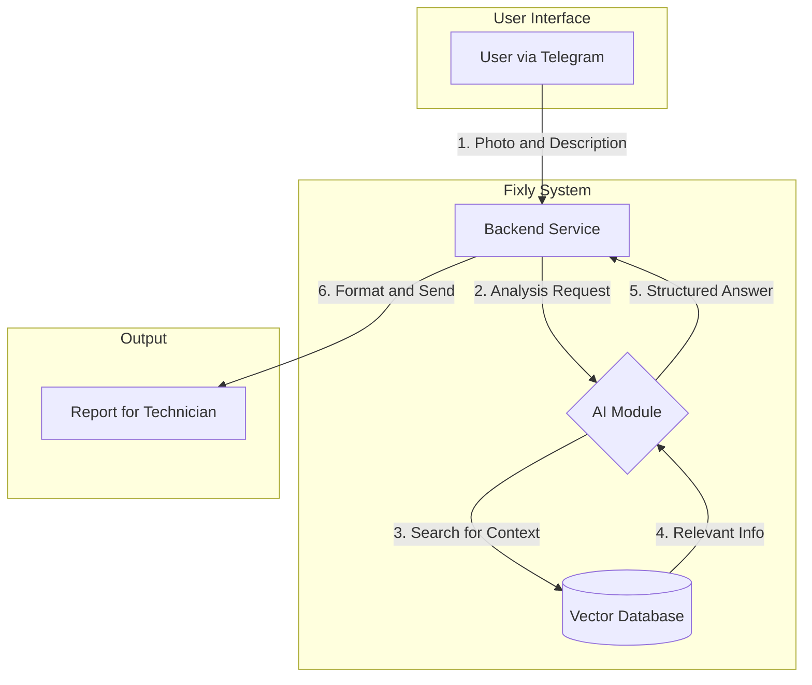

# ML System Design Doc: Fixly

**Статус:** В разработке
**Владелец:** Регина Галиева

## 1. Обзор

### 1.1. Зачем идем в разработку продукта?
Основная цель проекта — решить проблему неэффективности в работе мастеров по ремонту бытовой техники. Каждый третий выезд мастера оказывается впустую из-за неполной или неточной информации от клиента. Это приводит к прямым финансовым потерям (до 50 000 ₽ в месяц на одного мастера) и потере времени (до 3 часов на выезд). Fixly призван автоматизировать и стандартизировать процесс первичной диагностики, превращая хаотичные заявки от клиентов в структурированные и подготовленные заказы для мастеров.

### 1.2. Бизнес-требования и ограничения

#### Бизнес-требования
*   **Модель монетизации**: SaaS-модель с Freemium доступом (первая неделя бесплатно).
    *   **Тарифы (Россия)**: "Мастер" (1990 ₽/мес), "Бригада" (7990 ₽/мес).
*   **Целевая аудитория**: Частные мастера по ремонту, небольшие ремонтные бригады. 
*   **Рынки**: Начальный фокус на рынке России.
*   **Ключевая ценность для пользователя**: Экономия денег (окупаемость за 1 выезд) и времени, повышение лояльности клиентов.
*   **План развития**:
    *   **Q1**: Привлечь 10 мастеров в пилотный проект, обработать 100+ реальных заявок.
    *   **Q2**: Разработать веб-приложение.
    *   **Q3**: Достичь 100 платящих клиентов.

#### Ограничения
*   **Технические**: На начальном этапе используется итеративный подход. MVP будет реализован на основе простого RAG-решения с промптами, а не на сложной дообученной модели.
*   **Команда**: Ограниченный состав команды (2 основателя), требуется привлечение ML-инженера и Backend-разработчика.
*   **Рыночные**: Консервативность целевой аудитории (мастеров) и потенциальное появление аналогичных функций у крупных агрегаторов (Profi.ru, Avito и т.д.).
*   **Интерфейс**: На первом этапе единственным интерфейсом для пользователя является Telegram-бот.

### 1.3. Что входит в скоуп проекта/итерации, что не входит

#### Входит в скоуп (MVP / Первая итерация)
*   Разработка Telegram-бота как основного интерфейса взаимодействия.
*   Реализация диалоговой системы, которая задает уточняющие вопросы пользователю.
*   Возможность загрузки пользователем фотографий поломки.
*   Базовая ML-модель (RAG на основе LLM) для анализа текста и фото.
*   Генерация отчета, содержащего:
    *   Вероятную причину поломки.
    *   Список *типовых* запчастей.
    *   *Ориентировочную* смету.
*   Простая система онбординга для мастеров (предоставление ссылки на бота).

#### Не входит в скоуп (на данном этапе)
*   Разработка полноценного веб-приложения (запланировано на Q2).
*   Дообучение или файнтюнинг собственных LLM.
*   Интеграция с базами данных поставщиков запчастей для получения цен в реальном времени.
*   Функционал планирования выезда мастера или проведения платежей.
*   Анализ видео.
*   Система регистрации и управления аккаунтом внутри бота.

## 2. Дизайн и архитектура

### 2.1. Предпосылки решения
*   **Доступность данных**: Предполагается, что в открытом доступе (форумы, инструкции, YouTube-видео) достаточно информации для создания базы знаний, на основе которой RAG-система сможет делать точные выводы.
*   **Качество пользовательского ввода**: Мы предполагаем, что клиенты способны предоставить достаточно четкие фотографии и описания проблемы, чтобы AI мог их проанализировать.
*   **Технологическая реализуемость**: Современные мультимодальные LLM (например, GPT-4o, Claude 3) способны анализировать изображения и текст в рамках одного запроса, что делает задачу технически выполнимой.
*   **Ценность для пользователя**: Предполагается, что экономия от одного предотвращенного "пустого" выезда полностью оправдывает месячную подписку на сервис, что делает бизнес-модель жизнеспособной.

### 2.2. Постановка ML-задачи
Задача может быть сформулирована как **мультимодальная диалоговая система для классификации проблемы и извлечения информации**.

*   **Тип задачи**: Conversational AI, Multi-modal Classification, Information Extraction.
*   **Входные данные (Input)**:
    1.  Первоначальный текстовый запрос от пользователя (e.g., "у меня протекает кран на кухне").
    2.  Одна или несколько фотографий (.jpg, .png), предоставленных пользователем.
    3.  Текстовые ответы пользователя на уточняющие вопросы от бота (e.g., "кран однорычажный", "протекает у основания").
*   **Выходные данные (Output)**: Структурированный отчет в формате JSON или Markdown, содержащий:
    *   `diagnosis` (string): Краткое описание наиболее вероятной причины поломки (e.g., "Износ уплотнительной прокладки в основании смесителя").
    *   `required_parts` (list of strings): Список необходимых деталей (e.g., ["Кольцевая прокладка для смесителя X", "ФУМ-лента"]).
    *   `estimated_cost` (object): Предварительная смета, разделенная на стоимость запчастей и работы (e.g., `{"parts": "200-500 руб", "work": "1000-1500 руб"}`).
    *   `confidence_score` (float, optional): Оценка уверенности модели в поставленном диагнозе (от 0 до 1).

### 2.3. Блок-схема решения

Ниже представлена высокоуровневая блок-схема предлагаемой системы.

**Описание схемы:**
1.  **Клиент** отправляет фото и описание проблемы через Telegram.
2.  **Backend-сервис** получает запрос и передает его **AI Orchestrator**.
3.  **AI Orchestrator** с помощью **LLM Agent** анализирует запрос. Если информации недостаточно, он генерирует уточняющий вопрос и отправляет его клиенту.
4.  Когда собрано достаточно данных, агент делает запрос к векторной базе данных (**Vector DB**), чтобы получить релевантную информацию (инструкции, похожие случаи).
5.  Эта информация вместе с историей диалога и фото передается в **Мультимодальный LLM**.
6.  LLM возвращает структурированный JSON с диагнозом, списком деталей и сметой.
7.  **Backend** форматирует этот JSON в читаемый отчет и отправляет его **Мастеру**.

---
